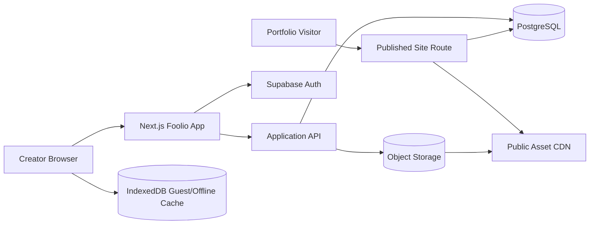
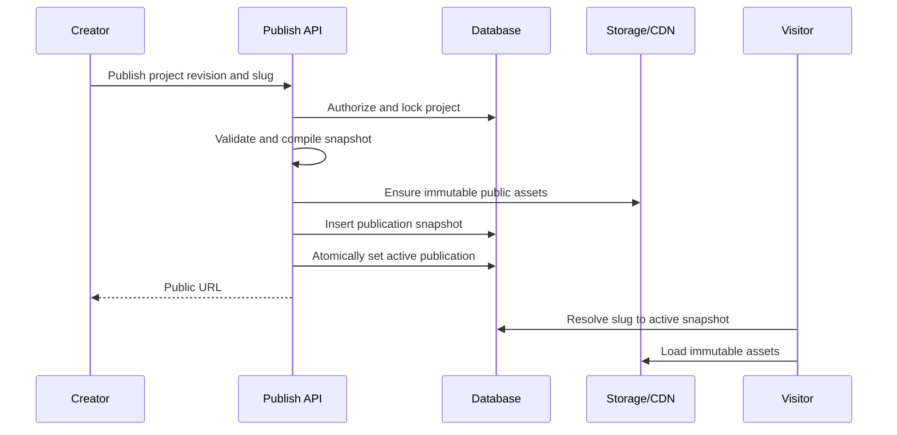

# Foolio Technical Architecture

## 1. Architecture Goals

- One canonical document model for Edit, Animate, Preview, and Publish.
- Deterministic rendering at a given viewport and scroll offset.
- Fast local interaction with durable background persistence.
- Guest-first operation without creating a second editor implementation.
- Immutable, atomic publication snapshots.
- A modular monolith for the first release, with clean boundaries around rendering, persistence, and publishing.

## 2. Proposed Stack

| Area | Choice | Reason |
| --- | --- | --- |
| Web application | Next.js App Router, React, TypeScript | One codebase for authenticated app, APIs, preview, and public sites |
| Styling | CSS Modules plus shared CSS custom-property tokens | Fits the bespoke Figma visual system without utility-class coupling |
| Client state | Zustand + Immer + command history | Fast editor updates, compact subscriptions, and explicit undo/redo |
| Validation | Zod | Shared validation for commands, APIs, snapshots, and migrations |
| DOM transforms | Moveable + Selecto | Proven selection, drag, resize, rotate, snapping, and marquee behavior |
| Paths | SVG + `perfect-freehand` | DOM-compatible pen output suitable for preview and publish |
| Timeline virtualization | TanStack Virtual | Keeps track/keyframe UI responsive on large documents |
| Authentication/data | Supabase Auth + PostgreSQL | Email/password, Google OAuth, relational data, and row-level security |
| Asset storage | Supabase Storage initially | Private drafts and public publication assets under the same account model |
| Guest storage | IndexedDB through Dexie | Structured local documents and image blobs with transactional writes |
| Tests | Vitest, Testing Library, Playwright | Geometry/unit coverage and browser-level workflow verification |
| Observability | Sentry plus structured server logs | Client/runtime errors, publish failures, and request correlation |

The existing static HTML/CSS/JavaScript landing page is a visual prototype. It should be preserved as a reference while the production application is scaffolded rather than used as the editor foundation.

## 3. System Context



## 4. Application Boundaries

```text
src/
  app/
    (marketing)/             landing and auth entry
    (builder)/projects/...   authenticated/guest editor shell
    preview/...              draft preview route
    p/[slug]/                public portfolio route
    api/...                  mutation, upload, and publish endpoints
  components/
    design-system/           Figma-derived controls and tokens
    builder-shell/           menubar, sidebars, layers, toolbar
    timeline/                tracks, ruler, playhead, keyframes
  editor/
    commands/                validated document operations
    history/                 undo/redo transaction stack
    selection/               selection and tool state
    tools/                   select, shape, text, upload, polygon, pen, sprite
  document/
    schema/                  versioned canonical document types
    geometry/                transforms, bounds, snapping, breakpoints
    animation/               interpolation and track evaluation
    migrations/              document-version migrations
  renderer/
    scene/                   shared DOM/SVG element renderer
    runtime/                 scroll driver and sprite playback
  persistence/
    authenticated/           autosave API adapter
    guest/                   Dexie adapter and account migration
  publishing/
    validation/              preflight checks
    snapshot/                immutable snapshot creation
  server/
    auth/                    session and authorization helpers
    repositories/            database/storage access
```

Dependencies point inward toward `document` and its pure functions. The shared renderer may depend on the document schema, but it must not depend on editor state, Supabase, or builder chrome.

## 5. Canonical Document and Renderer

The canonical project document is a versioned scene graph. Elements use stable IDs and explicit parent/child ordering. Content and asset identity are shared across viewports; geometry and animation can be overridden by viewport.

The renderer receives only:

```ts
type RenderInput = {
  document: ProjectDocument;
  pageId: string;
  viewport: "desktop" | "mobile";
  scrollOffsetPx: number;
  mode: "editor" | "preview" | "published";
};
```

It produces semantic DOM for text/images and SVG for paths/polygons. Editor-only overlays, handles, rulers, and selection boxes are siblings above the rendered scene, not part of the document.

This avoids canvas-to-HTML translation drift and keeps published text selectable and accessible. Canvas-like authoring behavior comes from transform overlays and absolute positioning within a fixed authoring coordinate system.

## 6. Coordinate and Responsive Model

- All authored geometry uses CSS pixels in page coordinates.
- Each page has `widthPx`, `viewportHeightPx`, and `scrollLengthPx` per authored viewport.
- Runtime document height is `viewportHeightPx + scrollLengthPx`; the timeline range and maximum `scrollY` are both `0..scrollLengthPx`.
- Desktop and mobile are explicit layout variants with shared element IDs.
- A viewport override contains only values that differ from the base desktop element.
- Elements are positioned relative to their parent; animation values use the same coordinate space.
- Rotation is degrees clockwise; opacity is normalized to `0..1`.
- Published rendering selects mobile below a configured breakpoint and desktop otherwise.
- The initial release uses fixed authoring widths and centers/scales the preview container as needed; it does not silently rewrite authored coordinates.

Snapping is a presentation concern. Snap guides influence the command result but are not persisted.

## 7. Editor State and Commands

Editor state is split into:

- **Document state:** serializable project content eligible for autosave.
- **Session state:** active page, viewport, mode, selected IDs, active tool, hover, zoom, open panels, and timeline playhead.
- **Derived state:** layer tree, evaluated animation values, bounds, publish errors, and save status.

Every persisted change is issued as a validated command, for example:

```ts
type EditorCommand =
  | { type: "element.create"; payload: CreateElementInput }
  | { type: "element.patch"; payload: PatchElementInput }
  | { type: "element.reparent"; payload: ReparentElementInput }
  | { type: "keyframe.upsert"; payload: UpsertKeyframeInput }
  | { type: "page.resize"; payload: ResizePageInput };
```

Commands produce patches and inverse patches through Immer. One pointer gesture is coalesced into one history entry. Autosave batches carry a base revision and idempotency key. Server conflicts return the latest revision; real-time collaboration is out of scope, so a conflicting stale tab must reload or explicitly overwrite after warning.

## 8. Animation Engine

### Authoring

Each property has an ordered keyframe track. The playhead is a page scroll offset in pixels. Evaluation is a pure function:

$$
t = \frac{s - s_0}{s_1 - s_0}
$$

$$
v(s) = v_0 + E(t)(v_1 - v_0)
$$

where $s$ is the current scroll offset, $s_0$ and $s_1$ are neighboring keyframe offsets, and $E$ is the selected easing function. Values clamp to the nearest endpoint outside a track's keyframe range.

Transforms are composed in a fixed order: translate, rotate, then any visual scale derived during evaluation. Width and height remain layout dimensions so text wrapping is deterministic.

### Runtime

- The published scroll driver observes `window.scrollY` and evaluates only animated elements.
- Updates are batched in `requestAnimationFrame`.
- Runtime writes CSS custom properties to avoid React rerenders on every scroll event.
- Track data is precompiled into sorted numeric arrays when the page loads.
- `prefers-reduced-motion: reduce` renders a defined static pose, initially the first keyframe or base value.
- Sprite frames are selected discretely from normalized progress over their assigned scroll range.

Native `ScrollTimeline` can be an optimization after behavior is proven, but it is not the source of truth because browser support and exact pixel scrubbing must remain consistent.

## 9. Persistence and Autosave

### Authenticated Flow

1. The client applies a command optimistically.
2. The command is added to an autosave batch and mirrored to IndexedDB as a recovery cache.
3. After a short debounce or explicit flush, the client sends the batch with `baseRevision` and `idempotencyKey`.
4. The server authorizes ownership, validates commands, applies them transactionally, increments the project revision, and returns the accepted revision.
5. The client marks the batch durable and removes it from the retry queue.

Store a materialized current document for fast load plus periodic revision snapshots for recovery. Do not store one database row per pointer movement.

### Guest Flow

Guest documents use the same schema and command layer. The persistence adapter writes transactions to Dexie, including uploaded image blobs. `beforeunload` depends on the adapter's pending-write count, not merely on whether the document has ever changed.

### Guest-to-Account Migration

1. Authenticate the user without deleting local data.
2. Reserve a server project ID and upload assets using content hashes.
3. Rewrite local asset references to durable asset IDs.
4. Create the project document in one server transaction.
5. Verify the remote revision and assets.
6. Mark the local project migrated; delete it only after the user opens the remote project successfully.

The operation uses a migration ID so retries cannot create duplicate projects.

## 10. Asset Pipeline

- The browser validates file count, apparent MIME type, dimensions, and size before upload.
- The server verifies magic bytes and rejects unsupported or dangerous content.
- Draft assets are private and served through signed URLs.
- Raster images receive optimized renditions and metadata (width, height, hash, dominant color).
- Original files remain available until all referencing projects delete them and retention expires.
- Publishing copies or promotes immutable renditions to a public content-addressed path.
- Sprite frames are normal image assets connected through ordered `sprite_frames` records.
- Uploaded SVG is excluded initially; internal pen/polygon SVG paths are schema-controlled and cannot contain scripts.

## 11. Publishing Architecture



The publication snapshot contains a schema version, normalized document subset, compiled animation tracks, asset manifest, and source project revision. Public routes never read the mutable draft document. A CDN cache key includes publication ID, so re-publishing changes the key without invalidating in-flight visitors.

## 12. Authentication and Authorization

- Supabase Auth provides email/password and Google OAuth.
- PostgreSQL row-level security limits projects, pages, revisions, and draft assets to their owner.
- Server routes still perform explicit ownership checks; RLS is defense in depth.
- Guest IDs are random local identifiers and grant no server privileges.
- Publishing, unpublishing, and slug changes require a recent authenticated session.
- Public APIs expose only active publication snapshots and public asset metadata.

## 13. Security Controls

- Never accept raw HTML, CSS, or JavaScript in a project document.
- Render text as text nodes and validate link protocols.
- Enforce Zod schemas and document-size limits at every write boundary.
- Use content security policy on public sites and builder routes.
- Rate-limit auth, upload, and publish endpoints.
- Validate uploaded bytes, cap decompressed image dimensions, and strip metadata where appropriate.
- Use signed draft URLs with short expiry and content-addressed immutable public URLs.
- Record publish/unpublish actions in an audit log.

## 14. Performance Strategy

- Subscribe builder components to narrow Zustand slices.
- Keep pointer-move state outside persisted React state; commit once at gesture end.
- Virtualize Layers and timeline rows for large projects.
- Evaluate only tracks visible on the active page.
- Use CSS transforms during gestures; commit layout dimensions after resize completion.
- Lazy-load sidebar tools and image editing code.
- Preload the next sprite frame and cap source dimensions.
- Memoize compiled animation tracks by document revision.
- Performance-test at 200 elements, 500 keyframes, and 50 image assets.

## 15. Testing Strategy

- **Unit:** document migrations, command inverses, tree invariants, geometry, keyframe interpolation, sprite frame selection, publish validation.
- **Component:** toolbar modes, Layers synchronization, property controls, timeline keyboard/pointer behavior, save states.
- **Integration:** authenticated autosave, revision conflicts, guest persistence, guest migration, asset lifecycle, atomic publish.
- **End-to-end:** create portfolio, animate element, preview both viewports, reload, publish, and visit public URL.
- **Visual:** screenshot baselines for Figma-aligned screens and representative published projects.
- **Performance:** scripted drag/scrub/scroll scenarios against the reference-size document.

## 16. Deployment Environments

- `local`: local Next.js plus isolated Supabase development project or local stack.
- `preview`: per-branch web deployment against a non-production backend.
- `staging`: production-like auth, storage, database, and publish domain.
- `production`: separate secrets, buckets, database, OAuth callback URLs, and monitoring.

Database migrations are forward-only and reviewed. Document migrations are versioned pure functions and tested against stored fixtures.
