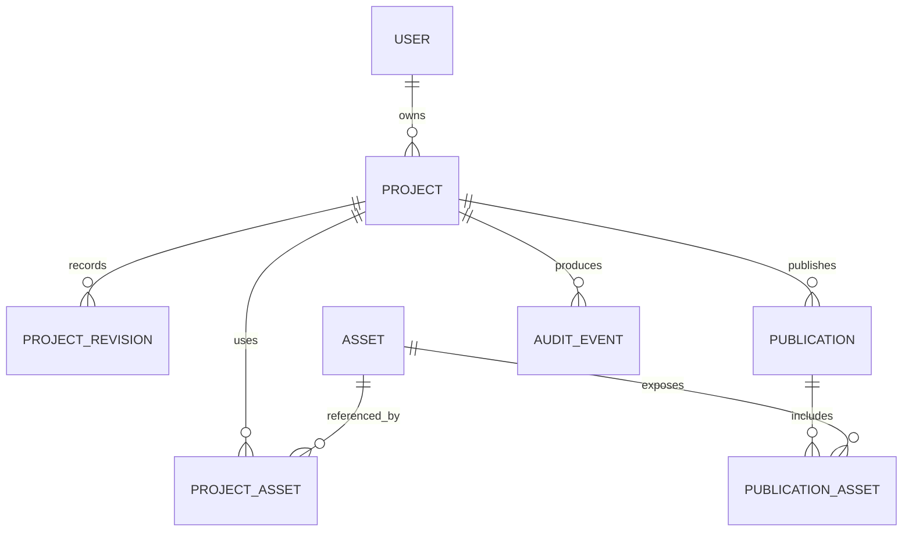

# Foolio Data Model

## 1. Modeling Principles

- The current draft is a versioned scene-graph document optimized for loading and editing.
- Relational tables own identity, access, assets, revisions, and publications.
- Elements and keyframes use stable client-generated UUIDs so guest projects can migrate without remapping every reference.
- Published sites use immutable snapshots rather than live draft rows.
- All geometry and scroll offsets are CSS-pixel numbers with finite-value validation.

## 2. Relationship Overview



Pages, elements, viewport overrides, animation tracks, keyframes, and sprite frame ordering live inside the versioned project document. This avoids expensive multi-table writes for each gesture while keeping server-level ownership and publishing relational.

## 3. Relational Entities

### `profiles`

| Column | Type | Notes |
| --- | --- | --- |
| `id` | uuid PK | Matches Supabase Auth user ID |
| `display_name` | text | Optional creator name |
| `avatar_url` | text | Optional |
| `created_at` | timestamptz | Server generated |
| `updated_at` | timestamptz | Server generated |

### `projects`

| Column | Type | Notes |
| --- | --- | --- |
| `id` | uuid PK | May originate in a guest document |
| `owner_id` | uuid FK | Required |
| `name` | text | Builder-facing name |
| `document_version` | integer | Schema version of `document` |
| `document` | jsonb | Materialized current draft |
| `revision` | bigint | Monotonic optimistic-concurrency token |
| `active_publication_id` | uuid nullable FK | Current public snapshot |
| `created_at` | timestamptz | Server generated |
| `updated_at` | timestamptz | Server generated |
| `deleted_at` | timestamptz nullable | Soft delete/retention |

Indexes: `owner_id, updated_at desc`; partial index for non-deleted projects.

### `project_revisions`

| Column | Type | Notes |
| --- | --- | --- |
| `id` | uuid PK | Revision snapshot ID |
| `project_id` | uuid FK | Required |
| `revision` | bigint | Unique per project |
| `document_version` | integer | Snapshot schema version |
| `document` | jsonb | Periodic or explicit snapshot |
| `reason` | text | `autosave`, `checkpoint`, `pre_publish`, `migration` |
| `created_by` | uuid FK | Owner in MVP |
| `created_at` | timestamptz | Server generated |

Unique index: `(project_id, revision)`.

### `assets`

Uploads are restricted to PNG, JPEG, and WebP. Guest projects cap at 20 assets per project and 8MB per image, enforced before an asset enters the document (see ADR-022).

| Column | Type | Notes |
| --- | --- | --- |
| `id` | uuid PK | Stable asset ID |
| `owner_id` | uuid FK | Uploading owner |
| `content_hash` | text | SHA-256 for dedupe/integrity |
| `storage_key` | text | Private original object key |
| `media_type` | text | Server-verified MIME type |
| `byte_size` | bigint | Original bytes |
| `width_px` | integer | Raster width |
| `height_px` | integer | Raster height |
| `status` | text | `uploading`, `ready`, `failed`, `quarantined` |
| `metadata` | jsonb | Renditions and safe image metadata |
| `created_at` | timestamptz | Server generated |
| `deleted_at` | timestamptz nullable | Retention marker |

Unique index may use `(owner_id, content_hash)` to deduplicate per owner.

### `project_assets`

| Column | Type | Notes |
| --- | --- | --- |
| `project_id` | uuid FK | Required |
| `asset_id` | uuid FK | Required |
| `created_at` | timestamptz | Server generated |

Primary key: `(project_id, asset_id)`. References are reconciled from the accepted project document after save.

### `publications`

| Column | Type | Notes |
| --- | --- | --- |
| `id` | uuid PK | Immutable publication ID |
| `project_id` | uuid FK | Source project |
| `source_revision` | bigint | Draft revision published |
| `slug` | citext | Globally unique active public slug |
| `title` | text | Public metadata |
| `description` | text nullable | Public metadata |
| `snapshot_version` | integer | Published schema version |
| `snapshot` | jsonb | Compiled public document/runtime data |
| `status` | text | `building`, `ready`, `failed`, `retired` |
| `created_by` | uuid FK | Publisher |
| `created_at` | timestamptz | Server generated |
| `activated_at` | timestamptz nullable | When made active |

Only `ready` publications can become active. Slug ownership history should prevent accidental takeover during a short retention period after unpublish.

### `publication_assets`

| Column | Type | Notes |
| --- | --- | --- |
| `publication_id` | uuid FK | Required |
| `asset_id` | uuid FK | Source asset |
| `public_key` | text | Immutable CDN object key |
| `content_hash` | text | Integrity/cache identity |

Primary key: `(publication_id, asset_id)`.

### `idempotency_keys`

| Column | Type | Notes |
| --- | --- | --- |
| `owner_id` | uuid FK | Scope |
| `key` | text | Client-generated operation ID |
| `operation` | text | `autosave`, `guest_migration`, or `publish` |
| `response` | jsonb | Successful response for retry |
| `expires_at` | timestamptz | Cleanup boundary |

Primary key: `(owner_id, key, operation)`.

### `audit_events`

Records security- and lifecycle-relevant actions such as sign-in method changes, project migration, publish, slug change, unpublish, and delete. Audit payloads must not contain credentials or raw asset bytes.

## 4. Canonical Project Document

```ts
type ProjectDocument = {
  schemaVersion: number;
  projectId: string;
  name: string;
  settings: ProjectSettings;
  pageOrder: string[];
  pages: Record<string, PageNode>;
  elements: Record<string, ElementNode>;
  animations: Record<string, ElementAnimation>;
  assetIds: string[];
};

type ProjectSettings = {
  breakpointPx: number;
  defaultViewport: "desktop" | "mobile";
  reducedMotionPose: "base" | "first-keyframe";
};

type PageNode = {
  id: string;
  name: string;
  slug: string;
  rootElementIds: string[];
  viewports: Record<"desktop" | "mobile", PageViewport>;
};

type PageViewport = {
  widthPx: number;
  viewportHeightPx: number;
  scrollLengthPx: number;
  background: Paint;
};
```

`pageOrder` and each child ID array are authoritative for ordering. Records are maps for constant-time lookup and stable patch paths.

`breakpointPx` defaults to `768`; viewport widths at or above this value use the desktop viewport, and narrower widths use mobile (see `decisions.md` ADR-005).

## 5. Elements

```ts
type ElementKind =
  | "group"
  | "shape"
  | "polygon"
  | "text"
  | "image"
  | "path"
  | "sprite";

type ElementNode = {
  id: string;
  pageId: string;
  parentId: string | null;
  kind: ElementKind;
  name: string;
  childIds: string[];
  hidden: boolean;
  locked: boolean;
  base: ElementStyle;
  viewportOverrides: Partial<Record<"mobile", Partial<ElementStyle>>>;
  content: ElementContent;
};

type ElementStyle = {
  x: number;
  y: number;
  width: number;
  height: number;
  rotationDeg: number;
  opacity: number;
  fill?: Paint;
  stroke?: Stroke;
  borderRadiusPx?: number;
};
```

Content is a discriminated union:

```ts
type ElementContent =
  | { kind: "group" }
  | { kind: "shape"; shape: "rectangle" | "ellipse" }
  | { kind: "polygon"; points: Array<{ x: number; y: number }> }
  | { kind: "text"; text: string; typography: Typography }
  | { kind: "image"; assetId: string; fit: "cover" | "contain"; alt: string }
  | { kind: "path"; points: number[][]; svgPath: string; closed: boolean }
  | { kind: "sprite"; frames: SpriteFrame[]; playback: SpritePlayback };

type SpriteFrame = {
  id: string;
  assetId: string;
  order: number;
};

type SpritePlayback = {
  startOffsetPx: number;
  endOffsetPx: number;
  behavior: "clamp";
};
```

Frame selection is `frameIndex = min(frames.length - 1, floor(t * frames.length))`, where `t` is the clamped `0..1` progress between `startOffsetPx` and `endOffsetPx`. Behavior is always `clamp` (no loop/crossfade in the first release; see ADR-021).

Store source pen points so path-generation improvements can migrate old paths, while also storing the current deterministic `svgPath` used by the renderer.

## 6. Animation Model

```ts
type AnimatableProperty =
  | "x"
  | "y"
  | "width"
  | "height"
  | "rotationDeg"
  | "opacity";

type ElementAnimation = {
  elementId: string;
  viewport: "desktop" | "mobile";
  tracks: Partial<Record<AnimatableProperty, AnimationTrack>>;
};

type AnimationTrack = {
  property: AnimatableProperty;
  keyframes: Keyframe[];
};

type Keyframe = {
  id: string;
  offsetPx: number;
  value: number;
  easing: Easing;
};

type Easing =
  | { type: "linear" }
  | { type: "ease-in" | "ease-out" | "ease-in-out" }
  | { type: "cubic-bezier"; x1: number; y1: number; x2: number; y2: number };
```

The easing on a keyframe applies to the segment from that keyframe to the next. Keyframes are persisted sorted by `offsetPx`, with ID as a stable tie-breaker during editing.

If an element has no mobile-viewport `ElementAnimation` entry for a property, playback uses the desktop track's evaluated value at the same `scrollOffsetPx`, so authors only add mobile entries where behavior diverges (see ADR-005).

### Animation Invariants

- At most one keyframe exists for `(elementId, viewport, property, offsetPx)`.
- `0 <= offsetPx <= page.viewports[viewport].scrollLengthPx`.
- Runtime document height equals `viewportHeightPx + scrollLengthPx`, making every valid offset reachable as `scrollY`.
- Opacity values are in `0..1`.
- Width and height are greater than zero.
- All numeric values are finite.
- Tracks may not target deleted, hidden, or cross-page elements during publish validation. Hidden tracks may remain in drafts for reversible editing.

## 7. Guest Database

Dexie stores:

```text
guest_projects: &id, updatedAt, migrationState
guest_assets: &id, projectId, contentHash, status
pending_operations: &id, projectId, sequence, createdAt
```

`guest_projects.document` uses the same `ProjectDocument` schema. `guest_assets.blob` contains the local file bytes. `pending_operations` supports crash recovery between in-memory commands and compacted document writes.

Migration states are `local`, `migrating`, `migrated`, and `migration_failed`. A successful migration records the remote project ID and revision before local cleanup.

## 8. Publication Snapshot

```ts
type PublicationSnapshot = {
  schemaVersion: number;
  publicationId: string;
  sourceProjectId: string;
  sourceRevision: number;
  metadata: {
    title: string;
    description?: string;
  };
  pages: PublishedPage[];
  elements: Record<string, PublishedElement>;
  compiledAnimations: Record<string, CompiledTrack[]>;
  assetManifest: Record<string, PublicAsset>;
};
```

The published form omits builder-only names, lock state, selection metadata, private storage keys, revision history, and unused assets. Compiled tracks use numeric arrays suitable for binary search and runtime interpolation.

## 9. Deletion and Retention

- Deleting an element removes or tombstones its animation tracks in the same command.
- Deleting a page removes all descendant elements and tracks atomically.
- Assets are garbage-collected only when no draft or retained publication references them.
- Deleted projects enter a retention period before hard deletion.
- Retired publications remain immutable for rollback during the retention window but are not publicly routable.

## 10. Schema Evolution

- `ProjectDocument.schemaVersion` and `PublicationSnapshot.schemaVersion` evolve independently.
- Every project migration is a deterministic function from version $n$ to $n+1$.
- The server migrates on load/save; the client understands only a bounded range and asks for refresh when too old.
- Migration fixtures cover text, each visual element type, responsive overrides, animations, and sprites.
- Unknown element kinds or properties fail closed during publish rather than being silently discarded.
